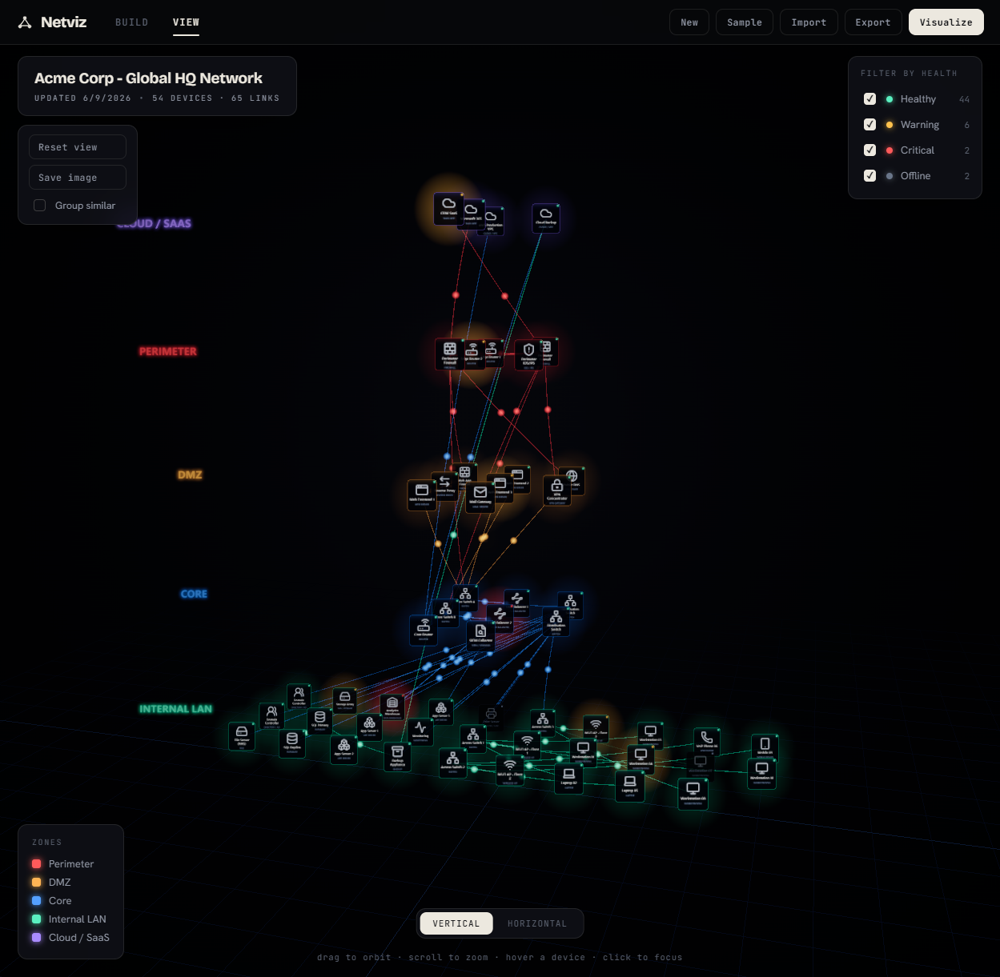

# 🫐 Netviz

  

Describe your network in a form, get a clean 3D topology you can actually read.
It's for IT and network people who want to see the shape of an infrastructure
without hand-drawing a diagram.

Everything you see is driven by a single `network.json`. Build it in the form,
or import one, and the 3D view rebuilds from it.



## Run it

```bash
npm install
npm run dev
```

Open the URL it prints. `npm run build` produces a static bundle in `dist/`.

## How it works

1. **Build.** Start from a template (Home Office, Small Business) or a blank
   canvas. Add devices (name, type, zone, health) and say what each one connects
   to. **Quick add** drops in many at once.
2. **Visualize.** Hit Visualize (or the View tab) to render the form in 3D.
3. **Save.** Export the JSON to share it or open it on another machine. Import
   brings one back, including one an AI generated from a picture of your diagram.

Your work auto-saves to the browser, so a refresh never loses it.

## The 3D view

| Control | What it does |
| --- | --- |
| Drag / scroll / right-drag | Orbit, zoom, pan |
| Hover a device | Highlights it and its links, dims the rest, shows a tooltip |
| Click a device | Flies the camera to it and opens a detail panel |
| Connection in the panel | Jumps to that neighbour |
| Vertical / Horizontal (bottom) | Switches the flow between top-down and left-to-right, live |
| Group similar (left) | Collapses identical devices into one card with a count |
| Reset view / Save image (left) | Re-frames the camera / downloads the view as a PNG |
| Filter by health (right) | Show or hide Healthy / Warning / Critical / Offline |

**How to read it.** Zones are network layers, drawn outside-in: internet and
perimeter first, internal endpoints last. Vertical stacks the layers top to
bottom, horizontal runs them left to right. Border colour is the zone, the icon
is the device type, the dot is health (warning pulses amber, critical pulses
red, offline is dimmed). Small moving points show traffic on active links.

## Builder

- **Zones** are your layers or segments. Recolour, rename, reorder. The order is
  the reading order (top zone is the most external).
- **Devices** cover about 40 types across Network, Security, Compute,
  Application, Data, Storage, Endpoints, Cloud and Facilities. Each has a zone
  and a health state. Unknown types fall back to a generic icon.
- **Connections** live on each device as chips ("connects to"). Link type
  (trunk, access, wan, vpn, wireless, storage) is inferred from the two ends.
- **Quick add** creates N devices of a type, in a zone, wired to an uplink, in
  one click. Good for ten identical workstations on a switch.

## Import

Two ways in, both validated before they load:

- **From a diagram.** Copy the built-in prompt, paste it into ChatGPT or Claude
  along with a screenshot of your current diagram (Visio export, PNG, a photo of
  a whiteboard), and paste back the JSON it returns.
- **Paste / file.** Paste JSON directly or upload a `.json` file.

## `network.json`

The single source of truth. Deliberately minimal: it describes topology, not
configuration. No IP plans or metrics required.

```jsonc
{
  "meta": { "name": "My Network" },

  "zones": [
    { "id": "edge",  "label": "Perimeter",    "color": "#ff5a5a" },
    { "id": "core",  "label": "Core",         "color": "#54a0ff" },
    { "id": "lan",   "label": "Internal LAN", "color": "#5af0c0" }
  ],

  "nodes": [
    {
      "id": "fw-01",          // required, unique
      "label": "Firewall A",  // shown on the card (defaults to id)
      "type": "firewall",     // a catalog type; unknown values get a generic icon
      "zone": "edge",         // a zones[].id
      "status": "ok"          // ok | warning | critical | offline
    }
  ],

  "links": [
    { "source": "fw-01", "target": "sw-core-01", "type": "trunk" } // type optional
  ]
}
```

`ip` and `metrics: { cpu, throughputMbps }` on a node are optional; if present
they show in the detail panel.

**Validation is forgiving.** A bad colour, an unknown type, a duplicate id, or a
link pointing at a missing device is handled (fixed or dropped) and logged to the
console. A file with no devices is rejected with a clear message.

You can hand-author a file, drop it in `public/`, and load it with
`?net=yourfile.json`.

## Project layout

```
index.html              landing page (one file, self-contained)
tool.html               the app shell (loads the builder + 3D viewer)
vite.config.js          relative base + two pages so it works on any path (incl. GitHub Pages)
public/network.json     the sample network (served at runtime)
public/preview.png      screenshot used by the README and landing
src/
  app.js                top bar, view switching, import/export, auto-save
  builder.js            the form: state -> network JSON
  presets.js            quick-start templates
  catalog.js            device-type catalogue, default zones, statuses
  icons.js              rasterizes Lucide icons to textures
  importModal.js        import panel (AI prompt + paste/upload)
  cluster.js            "group similar" graph transform
  viewer.js             the 3D engine (rebuilds on setNetwork)
  scene.js              renderer, camera, controls, bloom, backdrop
  layout.js             vertical/horizontal tier layout + framing
  environment.js        ground grid + zone labels
  nodes.js              device cards (icons, status, clusters)
  links.js              curved links + adjacency graph
  packets.js            traffic points
  interaction.js        hover/click raycasting + camera fly-to
  ui.js                 HUD: header, legend, filter, tooltip, detail panel
  config.js             visual + layout constants
```

## Built with

Vite and vanilla Three.js, no framework. Icons from [Lucide](https://lucide.dev)
(ISC). Type: Bricolage Grotesque, Hanken Grotesk, JetBrains Mono.

## Deploy to GitHub Pages

This repo ships a workflow (`.github/workflows/deploy.yml`) that builds the site
and publishes it on every push to `main`. After pushing, go to the repo's
**Settings -> Pages**, set **Source** to **GitHub Actions**, and the site goes
live at `https://natekali.github.io/netviz/`.
